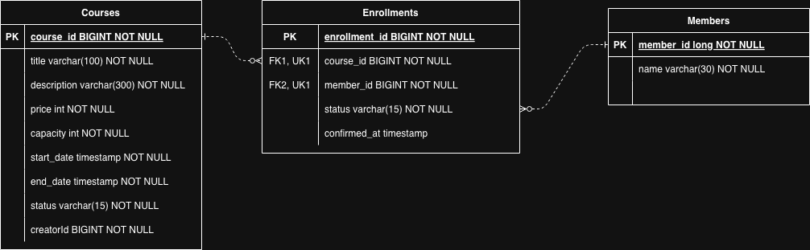

# Liveclass_BE_A

라이브클래스 프로덕트 엔지니어 과제 BE-A - 수강 신청 시스템 구현 프로젝트입니다.

## 프로젝트 개요

크리에이터가 강의를 개설 및 관리하고, 회원이 강의에 수강 신청한 뒤 결제 확정을 통해 수강 상태를 변경하는 REST API 서버입니다.

주요 기능은 다음과 같습니다.

- 강의 등록, 모집 시작, 모집 마감
- 강의 목록 조회 및 상태별 필터링
- 강의 상세 조회 시 현재 신청 인원 포함
- 수강 신청, 결제 확정, 수강 취소, 재신청
- 내 수강 신청 목록 조회 및 신청 상태별 필터링
- 강의별 결제 확정 수강생 목록 조회
- 강의 정원 초과 방지 및 동시 신청 상황을 고려한 비관적 락 적용

## 기술 스택

- Java 17
- Spring Boot 3.5.14
- Spring Web
- Spring Data JPA
- Hibernate
- Bean Validation
- H2 Database
- Lombok
- springdoc-openapi Swagger UI
- Gradle
- JUnit 5, AssertJ

## 실행 방법

### 사전 요구사항

- JDK 17 이상
- macOS/Linux 기준 Gradle Wrapper 실행 권한

### 애플리케이션 실행

```bash
./gradlew bootRun
```

기본 포트는 Spring Boot 기본값인 `8080`입니다.

```text
http://localhost:8080
```

Swagger UI는 다음 주소에서 확인할 수 있습니다.

```text
http://localhost:8080/swagger-ui/index.html
```

## 요구사항 해석 및 가정

- 인증/인가 시스템은 구현하지 않고, 요청 값의 `creatorId`, `memberId`, `role`을 사용하는 방식으로 단순화했습니다.
- 강의 등록은 `role` 값이 `CREATOR`인 경우에만 허용합니다.
- 강의 상태가 `DRAFT(초안)`일 때 `OPEN(모집 중)` 또는 `CLOSED(모집 마감)`으로 변경할 수 있습니다.
- 강의 상태가 `OPEN(모집 중)`일 때 `CLOSED(모집 마감)`으로 변경할 수 있습니다.
- 강의 상세 조회의 현재 신청 인원은 `PENDING`, `CONFIRMED` 상태의 신청만 계산합니다. `CANCELLED` 상태의 신청은 정원 계산에서 제외합니다.
- 강의 목록 조회는 상태 필터가 가능합니다.(`NULL, DRAFT, OPEN, CLOSED`)
- 수강 신청은 강의 상태가 `OPEN`인 경우에만 가능합니다.
- 수강 신청은 강의 정원을 초과하지 않을 경우에만 가능합니다.
- 동시에 여러 사람이 신청하는 경우 순차적으로 수강 신청이 진행되어야 합니다.
- 수강 신청 상태가 `PENDING(신청 완료, 결제 대기)`일 때 `CONFIRMED(결제 완료, 수강 확정), CANCELLED(취소됨)`으로 변경할 수 있습니다.
- 수강 신청 상태가 `CANCELLED(취소됨)`일 때 `PENDING(신청 완료, 결제 대기)`으로 변경할 수 있습니다.(재신청)
- 수강 취소시 결제 확정일로부터 7일 이내에 가능합니다.
- 내 수강 신청 목록은 상태 필터링과 페이징이 가능합니다.(`NULL, PENDING, CONFIRMED, CANCELLED`)
- 강의별 수강생 목록은 해당 강의를 개설한 크리에이터만 조회할 수 있으며, `CONFIRMED` 상태의 수강생만 반환합니다.
- 결제 연동은 외부 시스템 없이 `PENDING -> CONFIRMED` 상태 변경으로 대체했습니다.
- 회원 가입/로그인 요구사항은 없지만 API 테스트 편의를 위해 회원 생성 API를 별도로 제공했습니다.
- 데이터베이스는 별도 설정 없이 H2 인메모리 DB를 사용합니다.

## 설계 결정과 이유

- 과제의 `Class` 용어는 Java 예약어와의 혼동을 피하기 위해 코드에서는 `Course`로 표현했습니다.
- 도메인을 `course`, `enrollment`, `member`로 분리했습니다. 강의 관리, 수강 신청 관리, 회원 관리를 독립적으로 다루기 위함입니다.
- `course, member` 엔티티 간의 N:M 관계를 풀어내는 중간 역할로 `enrollment`를 사용하였습니다.
- `enrollment`와 `course`, `member`와의 관계는 단방향으로 설계하였습니다.
- Controller, Service, Repository, Entity 계층을 분리했습니다. 요청 처리, 비즈니스 규칙 등 책임을 명확히 나누기 위함입니다.
- 마지막 정원에 여러 사용자가 동시에 신청하는 상황을 고려해 강의 조회 시 `PESSIMISTIC_WRITE` 락을 사용했습니다.
- 수강 신청 중복 방지를 위해 애플리케이션 레벨 체크와 DB 유니크 제약 조건을 함께 사용했습니다.
- 공통 응답 형식은 `ApiResponse`로 통일했습니다.
- 비즈니스 예외는 `BusinessException`, `ErrorCode`, `GlobalExceptionHandler`로 일관되게 처리했습니다.
- 강의 상세 응답에는 `isEnrollable` 값을 포함해 클라이언트가 신청 가능 여부를 바로 판단할 수 있게 했습니다.
- 데이터 무결성을 위해 강의 신청 인원 조회 기능을 즉각적인 쿼리를 통해 조회하도록 설계하였습니다.
- 강의 신청 인원 조회를 위한 COUNT 쿼리의 성능 향상을 위해 `course_id, status` 복합 인덱스를 생성했습니다.
- 수강신청, 회원 존재 여부를 확인하는 함수에서 속도를 향상시키기 위해 limit 쿼리를 사용하였습니다.
- 강의별 수강생 목록 조회 시 회원 정보를 함께 조회하기 위해 `member` fetch join을 사용했습니다.

## 미구현 / 제약사항

- 대기열(waitlist) 기능은 구현하지 않았습니다.

## AI 활용 범위

- 구현한 코드의 품질 검증 및 피드백을 위해 AI를 활용하였습니다.
- 빠른 테스트 코드 작성을 위해 AI를 활용하였습니다.
- README.md 파일 초안 작성을 위해 AI를 활용하였습니다.

## API 목록 및 예시

모든 성공 응답은 다음 형식을 사용합니다.

```json
{
  "status": "SUCCESS",
  "message": "요청이 성공적으로 처리되었습니다.",
  "data": {}
}
```

### 회원 생성

```http
POST /api/v1/members?name=홍길동
```

```bash
curl -X POST "http://localhost:8080/api/v1/members?name=홍길동"
```

응답 예시:

```json
{
  "status": "SUCCESS",
  "message": "요청이 성공적으로 처리되었습니다.",
  "data": 1
}
```

### 강의 등록

```http
POST /api/v1/courses
```

```bash
curl -X POST "http://localhost:8080/api/v1/courses" \
  -H "Content-Type: application/json" \
  -d '{
    "title": "스프링 입문",
    "description": "스프링 부트와 JPA 기초 강의",
    "price": 10000,
    "capacity": 30,
    "startDate": "2026-06-01T10:00:00",
    "endDate": "2026-06-30T23:59:59",
    "creatorId": 1,
    "role": "CREATOR"
  }'
```

응답 데이터는 생성된 강의 ID입니다. 최초 상태는 `DRAFT`입니다.

### 강의 모집 시작

```http
PATCH /api/v1/courses/{courseId}/open?creatorId={creatorId}
```

```bash
curl -X PATCH "http://localhost:8080/api/v1/courses/1/open?creatorId=1"
```

`DRAFT` 상태의 강의만 `OPEN`으로 변경할 수 있습니다.

### 강의 모집 마감

```http
PATCH /api/v1/courses/{courseId}/close?creatorId={creatorId}
```

```bash
curl -X PATCH "http://localhost:8080/api/v1/courses/1/close?creatorId=1"
```

강의를 `CLOSED` 상태로 변경합니다.

### 강의 목록 조회

```http
GET /api/v1/courses
GET /api/v1/courses?status=OPEN
```

```bash
curl "http://localhost:8080/api/v1/courses?status=OPEN"
```

응답 예시:

```json
{
  "status": "SUCCESS",
  "message": "요청이 성공적으로 처리되었습니다.",
  "data": [
    {
      "id": 1,
      "title": "스프링 입문",
      "description": "스프링 부트와 JPA 기초 강의",
      "price": 10000,
      "capacity": 30,
      "currentCount": 0,
      "status": "OPEN",
      "startDate": "2026-06-01T10:00:00",
      "endDate": "2026-06-30T23:59:59",
      "enrollable": true
    }
  ]
}
```

### 강의 상세 조회

```http
GET /api/v1/courses/{courseId}
```

```bash
curl "http://localhost:8080/api/v1/courses/1"
```

강의 상세 조회 응답에는 현재 신청 인원인 `currentCount`가 포함됩니다.

### 수강 신청

```http
POST /api/v1/enrollments
```

```bash
curl -X POST "http://localhost:8080/api/v1/enrollments" \
  -H "Content-Type: application/json" \
  -d '{
    "courseId": 1,
    "memberId": 1
  }'
```

응답 데이터는 생성된 수강 신청 ID입니다. 최초 상태는 `PENDING`입니다.

### 결제 확정

```http
PATCH /api/v1/enrollments/{enrollmentId}/payment
```

```bash
curl -X PATCH "http://localhost:8080/api/v1/enrollments/1/payment"
```

`PENDING` 상태의 수강 신청을 `CONFIRMED`로 변경합니다.

### 수강 취소

```http
PATCH /api/v1/enrollments/{enrollmentId}/cancel
```

```bash
curl -X PATCH "http://localhost:8080/api/v1/enrollments/1/cancel"
```

이미 `CANCELLED` 상태인 신청은 다시 취소할 수 없습니다.

### 재신청

```http
PATCH /api/v1/enrollments/{enrollmentId}/re-enroll
```

```bash
curl -X PATCH "http://localhost:8080/api/v1/enrollments/1/re-enroll"
```

`CANCELLED` 상태의 신청을 다시 `PENDING`으로 변경합니다.

### 내 수강 신청 목록 조회

```http
GET /api/v1/enrollments/me?memberId={memberId}&page=0&size=10
GET /api/v1/enrollments/me?memberId={memberId}&status=CONFIRMED&page=0&size=10
```

```bash
curl "http://localhost:8080/api/v1/enrollments/me?memberId=1&status=PENDING&page=0&size=10"
```

응답 예시:

```json
{
  "status": "SUCCESS",
  "message": "요청이 성공적으로 처리되었습니다.",
  "data": {
    "content": [
      {
        "enrollmentId": 1,
        "courseId": 1,
        "memberId": 1,
        "status": "PENDING"
      }
    ],
    "pageable": {
      "pageNumber": 0,
      "pageSize": 10
    },
    "totalElements": 1,
    "totalPages": 1,
    "number": 0,
    "size": 10
  }
}
```

### 강의별 수강생 목록 조회

```http
GET /api/v1/enrollments/students?courseId={courseId}&creatorId={creatorId}
```

```bash
curl "http://localhost:8080/api/v1/enrollments/students?courseId=1&creatorId=1"
```

해당 강의를 개설한 크리에이터만 조회할 수 있으며, `CONFIRMED` 상태의 수강생만 반환합니다.

응답 예시:

```json
{
  "status": "SUCCESS",
  "message": "요청이 성공적으로 처리되었습니다.",
  "data": [
    {
      "studentId": 1,
      "name": "홍길동"
    }
  ]
}
```

## 데이터 모델 설명


### Member

회원 정보를 나타냅니다.

| 필드 | 설명 |
| --- | --- |
| `id` | 회원 ID |
| `name` | 회원 이름 |

### Course

강의 정보를 나타냅니다.

| 필드 | 설명 |
| --- | --- |
| `id` | 강의 ID |
| `creatorId` | 강의를 개설한 크리에이터 ID |
| `title` | 강의 제목 |
| `description` | 강의 설명 |
| `price` | 강의 가격 |
| `capacity` | 최대 수강 인원 |
| `startDate` | 수강 시작일 |
| `endDate` | 수강 종료일 |
| `status` | 강의 상태: `DRAFT`, `OPEN`, `CLOSED` |

### Enrollment

회원의 수강 신청 정보를 나타냅니다.

| 필드 | 설명 |
| --- | --- |
| `id` | 수강 신청 ID |
| `course` | 신청한 강의 |
| `member` | 신청한 회원 |
| `status` | 신청 상태: `PENDING`, `CONFIRMED`, `CANCELLED` |
| `confirmed_at` | 최종 결제 시점 |

제약 조건:

- `course_id`, `member_id` 조합에 유니크 제약을 둬 동일 회원의 동일 강의 중복 신청을 방지합니다.
- `course_id`, `status` 인덱스를 둬 강의별 신청 인원 계산 조회를 보조합니다.

## 테스트 실행 방법

전체 테스트는 다음 명령으로 실행합니다.

```bash
./gradlew test
```

테스트 리포트는 실행 후 다음 파일에서 확인할 수 있습니다.

```text
build/reports/tests/test/index.html
```

주요 테스트 범위:

- 강의 생성 성공/실패
- 강의 상태 변경 성공/실패
- 강의 목록 및 상세 조회
- 수강 신청 성공/실패
- 중복 신청 방지
- 수강 신청시 동시성 제어 테스트
- 정원 초과 방지
- 결제 확정 상태 변경
- 수강 취소 및 재신청
- 내 수강 신청 목록 조회
- 강의별 수강생 목록 조회
